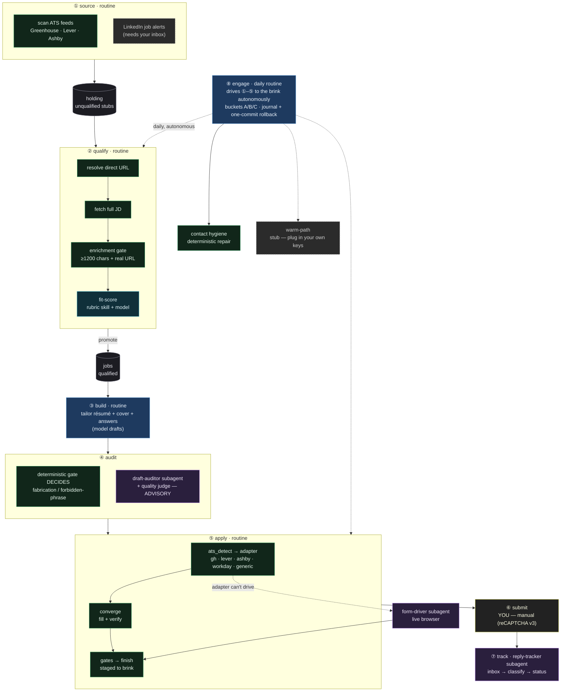

# career-engine

[](https://github.com/jobradshaw98-dude/career-engine/actions/workflows/ci.yml)
&nbsp;**1034 offline tests** · no API key, network, or browser needed

A multi-agent job-search engine that runs the whole pipeline — from *finding* a role to *staging*
the application — off your own structured profile. The stages, each a CLI subcommand:

1. **`source`** — scans public ATS job boards for new postings.
2. **`qualify`** — resolves each to a direct apply URL, fetches the full job description, gates on
   enrichment, fit-scores it, and promotes the keepers into your pipeline.
3. **`build`** — drafts a tailored, one-page **résumé + cover letter** for a specific job.
4. **`apply`** — fills the application form across several ATS backends and **stages it to the submit brink.**
5. **`engage`** — an autonomous daily routine that drives the stages above to the brink and keeps the
   pipeline clean, sorting every result into *auto-done* / *staged-for-you* / *needs-work*.

Each stage is an **AI routine** that leans on **deterministic, tested gates** for the decisions that
must be exact. Supporting subagents — a fabrication **auditor**, a live-browser **form-driver**, and a
**reply-tracker** — handle judgment and adaptation. See [Architecture](#architecture).

> ### It never clicks submit.
> Every run stops one click short. You review the filled form and the drafted documents, then
> *you* submit. This is a deliberate, load-bearing design choice — see [Safety & scope](#safety--scope).

> **About the sample data:** the bundled applicant **"Sam Rivera" is a fictional placeholder** —
> an invented person whose résumé, profile, and example letters exist only so the tool runs out of
> the box. Sam Rivera is not the author and not a real person. Replace the examples with your own
> facts and the tool writes from *yours*. (Author/maintainer: Jordan Bradshaw — see [About](#about).)

> **Design stance:** an LLM is great at *drafting and reasoning* and untrustworthy as a *gate*. So
> every decision that must be correct — is this field filled? is the applicant work-authorized? is
> this answer on-target? is it safe to submit? — is **deterministic, tested code**. The LLM drafts;
> the gates decide.

---

## What it produces

| Résumé | Cover letter |
|---|---|
|  |  |

*Generated by `career-engine build` from the bundled Sam Rivera profile against a sample job. Both
are tailored to the posting, grounded only in the profile facts, and auto-fit to one page.*

---

## Prerequisites

- **Python ≥ 3.11**
- **[Claude Code CLI](https://docs.anthropic.com/en/docs/claude-code)** (`claude`) on your PATH, logged in.
  Drafting runs through `claude -p` on your Claude subscription — **there is no metered-API path and
  no API key**. If `claude` isn't available, generation fails loudly rather than billing anything.
- **A Chromium-family browser** (Microsoft Edge, Google Chrome, or Chromium) for rendering PDFs.
  Auto-detected on Windows/macOS/Linux; override with the `BROWSER_PATH` env var.
- **For live form-filling only:** `playwright install chromium` (the `apply` flow drives real forms
  with Playwright). Not needed for `build` or the test suite.

## Install

```bash
git clone https://github.com/jobradshaw98-dude/career-engine
cd career-engine
python -m venv .venv
# Windows: .venv/Scripts/python.exe   |   macOS/Linux: .venv/bin/python
.venv/Scripts/python.exe -m pip install -e ".[test]"
```

## Configure (copy the examples, fill in your own facts)

```bash
mkdir -p data
cp examples/jobs.sample.json                  data/jobs.json
cp examples/watchlist.example.json            data/ats_watchlist.json   # companies `source` scans
cp examples/holding.example.json              data/holding.json         # `qualify` drains this
cp examples/fit_rubric.example.md             data/fit_rubric.md        # how `qualify` scores fit
cp examples/contacts.example.json             data/contacts.json        # `engage` CRM hygiene
cp examples/engage_config.example.json        data/engage_config.json   # `engage` lane flags
cp examples/profile.example.json              apply_engine/builder/profile.json
cp apply_engine/voice_profile.example.md      apply_engine/voice_profile.md
cp apply_engine/narrative.example.md          apply_engine/narrative.md
cp apply_engine/applicant_profile.example.json apply_engine/applicant_profile.json
```

Then edit each with your details. All of these are git-ignored — your data never gets committed.
The default data folder is `./data`; point elsewhere with the `ARIA_CORE_DATA` env var. See
[`examples/README.md`](examples/README.md) for what each file is.

## Use

```bash
# 1. Source new postings from your watchlist's ATS boards (never auto-writes jobs.json)
career-engine source scan                                   # scan feeds, print table, write a review queue

# 2. Qualify held stubs: resolve URL -> fetch JD -> enrich-gate -> fit-score -> promote
career-engine qualify run                                    # drain holding.json, promote the keepers
career-engine qualify resolve --company Acme --title "FDE"   # company + title -> direct apply URL

# 3. Build tailored documents for a job in jobs.json (or pass a raw JD file)
career-engine build --job JOB-001 --type both
career-engine build --jd-file path/to/jd.txt --company Globex --title "FDE"

# 4. Stage the application form to the submit brink (never submits)
career-engine apply --job JOB-001 --dry-run     # parse + plan, no navigation
career-engine apply --job JOB-001 --live         # fill the real form, then STOP

# 5. Run the autonomous daily routine (hygiene + stage-to-brink; --dry-run journals only)
career-engine engage run --dry-run               # plan + journal, zero writes
career-engine engage run                          # live: clean + stage to the brink, never submit/send
```

All subcommands are also runnable as `python -m apply_engine source|qualify|build|apply|engage ...`.
(The legacy `apply-engine` command remains as an alias.)

---

## Safety & scope

This tool is built to be **assistive, not evasive.** The boundaries are deliberate:

- **It never submits.** Forms are filled and verified to the submit brink; the final click is yours.
  (Automated final-submit also trips bot detection, so stopping is both honest and practical.)
- **It never solves or bypasses CAPTCHAs.** When it sees an hCAPTCHA, a visible reCAPTCHA, or a
  score-gated reCAPTCHA v3 at submit, it **stops and hands off to you.** There is no solver and no
  anti-detection, by design — and none should be added.
- **It does not automate LinkedIn.** The LinkedIn helper only *resolves* a LinkedIn posting to the
  employer's real ATS apply URL and bails on Easy-Apply. That's a feature, not a gap.
- **It refuses to fabricate.** Answers are grounded in your supplied facts; a compliance layer and
  accuracy checks block invented tools, numbers, employers, or outcomes.
- **You own ToS compliance.** Automating applications can violate a site's terms; that's your call to
  make for your own use. Use it on your own behalf, for your own applications.

## Architecture

The whole pipeline is **AI-orchestrated**, but the decisions that must be exact are made by
**deterministic, tested code**, not the model. Four kinds of moving part: an **AI routine** (a stage
that runs end-to-end), a **subagent** (a smaller AI spun up for one bounded job), a **tool / gate**
(deterministic Python), and a **skill** (a markdown rule-sheet the AI loads). The flow: `source`
finds leads → `qualify` enriches and scores them → `build` drafts the documents → `apply` fills the
form → **you** submit → `track` reads the reply. `engage` is the daily routine that drives it all to
the brink autonomously.



**Legend** — 🟦 AI routine · 🟪 subagent · 🟩 deterministic tool / gate · 🟦̲ skill (markdown rules) ·
🟨 you · ⬛ data store · ▱ dashed = needs your own keys or part of the broader system. The model
drafts and scores; every must-be-exact decision (filled? fabricated? promote? safe to submit?) is a
tested gate. Note the **audit** stage: the deterministic gate **decides**; the LLM accuracy and
quality judges are **advisory** review — your own eyes plus the gate are the submit authority.

> **What ships in this repo:** `source`, `qualify`, `build`, `apply`, and `engage` all run here —
> `engage` ships its reversibility spine (per-run journal + scoped, opt-in git commit for rollback)
> and its deterministic contact-hygiene lane. The **dashed** nodes need your own keys or belong to the
> broader [ARIA](https://github.com/jobradshaw98-dude/aria-fleet) system this was extracted from: the
> LinkedIn-alert source feed (your inbox), `warm-path` outreach (plug in your own contact-source +
> email-verify provider), and the `form-driver` / `reply-tracker` subagents. The fit rubric ships as a
> generic example — replace it with your own.

## Test suite

**1034 tests passing offline** — no API key, network, or browser needed (the suite parses HTML
fixtures of real ATS forms and fakes the LLM call):

```bash
.venv/Scripts/python.exe -m pytest -q
.venv/Scripts/python.exe -m pytest --cov=apply_engine -q   # with coverage
```

The default run is the offline suite. Two opt-in groups are deselected by `pytest.ini` and require
host resources CI doesn't have, so they're not part of the offline count:

- **117 browser tests** (`-m browser`) drive a live Chromium-family browser; run them on a host with
  a browser via `pytest -m browser`.
- **15 LLM tests** (`-m llm`) shell out to the real `claude` CLI; run them with `pytest -m llm`.

`requirements.txt` marks `pywin32` (a Windows-only dependency) with an environment marker, so
install works on macOS/Linux too. A handful of tests depend on modules that live in a separate
private repo and are intentionally not published; they're skipped via `pytest.ini`, which documents
exactly which and why. CI runs the offline suite on Python 3.11 + 3.12 on every push.

## Layout

| Path | Role |
|---|---|
| `apply_engine/source/` | `source`: scan public ATS boards for new postings |
| `apply_engine/qualify/` | `qualify`: resolve URL → fetch JD → enrichment gate → fit-score → promote |
| `apply_engine/builder/` | `build`: profile + JD → `claude -p` → tailored résumé/cover PDFs |
| `apply_engine/adapters/` | `apply`: one module per ATS backend + generic fallback |
| `apply_engine/converge.py` | Fill-and-verify loop until the form is complete |
| `apply_engine/{completeness,compliance,screening,quality_judge}.py` | Deterministic gates |
| `apply_engine/finish.py` | Submit-integrity check + stage-to-brink (never submits) |
| `apply_engine/engage/` | `engage`: autonomous daily routine — hygiene + stage-to-brink, journal + rollback |
| `apply_engine/tests/` | 100+ test files; `tests/fixtures/` real-ATS HTML |
| `examples/` | Sample job, profile, holding, rubric, contacts to copy and fill in |

## About

Built by **Jordan Bradshaw** — an R&D / simulation engineer (FEA, design optimization) who builds
multi-agent AI systems that do real work autonomously. This is the "ships real, tested product" tool
from a broader personal multi-agent system, [ARIA](https://github.com/jobradshaw98-dude/aria-fleet).

*(The sample applicant "Sam Rivera" throughout the examples is fictional — see the note at the top.)*

## License

[MIT](LICENSE) © 2026 Jordan Bradshaw.
