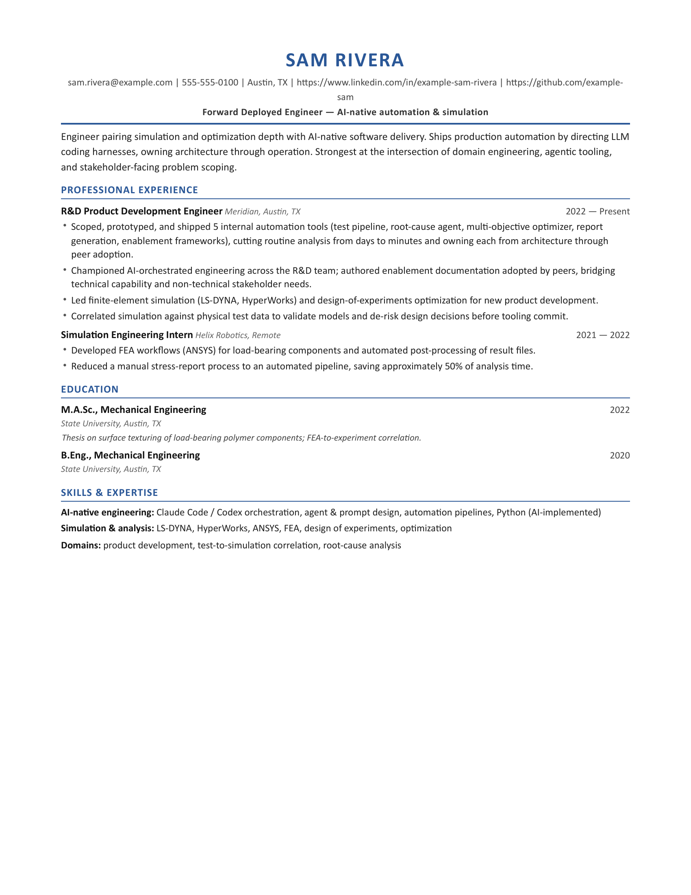
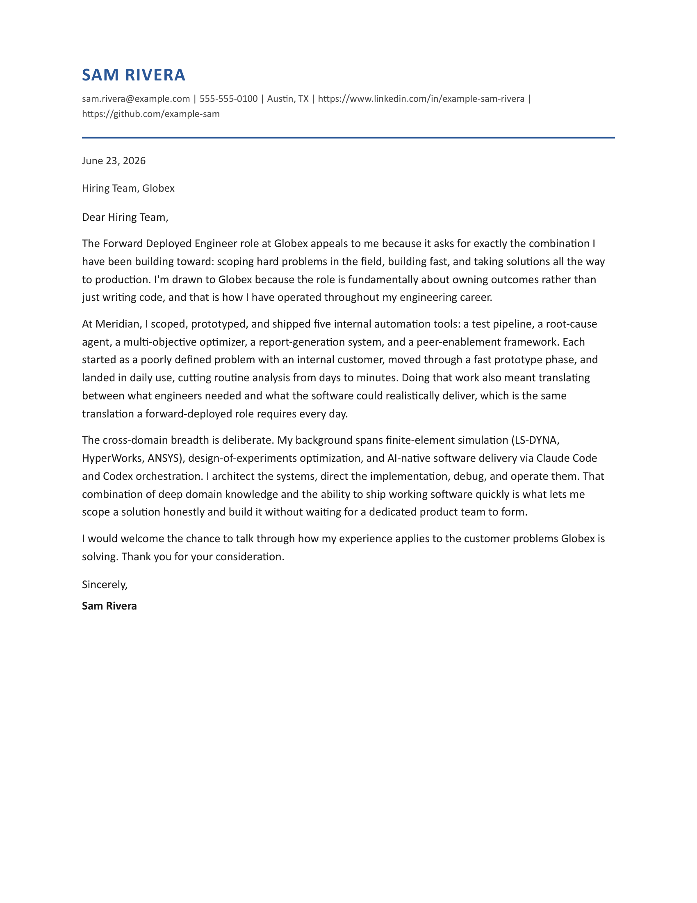

# job-apply-engine

[](https://github.com/jobradshaw98-dude/job-apply-engine/actions/workflows/ci.yml)
&nbsp;**1,070 tests** · offline suite · no API key needed

A job-application toolkit that does two things from your own structured profile:

1. **`build`** — drafts a tailored, one-page **résumé + cover letter** for a specific job.
2. **`apply`** — fills the application form across several ATS backends and **stages it to the submit brink.**

> ### It never clicks submit.
> Every run stops one click short. You review the filled form and the drafted documents, then
> *you* submit. This is a deliberate, load-bearing design choice — see [Safety & scope](#safety--scope).

> **About the sample data:** the bundled applicant **"Sam Rivera" is a fictional placeholder** —
> an invented person whose résumé, profile, and example letters exist only so the tool runs out of
> the box. Sam Rivera is not the author and not a real person. Replace the examples with your own
> facts and the tool writes from *yours*. (Author/maintainer: Jordan Bradshaw — see [About](#about).)

> **Design stance:** an LLM is great at *drafting and reasoning* and untrustworthy as a *gate*. So
> every decision that must be correct — is this field filled? is the applicant work-authorized? is
> this answer on-target? is it safe to submit? — is **deterministic, tested code**. The LLM drafts;
> the gates decide.

---

## What it produces

| Résumé | Cover letter |
|---|---|
|  |  |

*Generated by `apply-engine build` from the bundled Sam Rivera profile against a sample job. Both
are tailored to the posting, grounded only in the profile facts, and auto-fit to one page.*

---

## Prerequisites

- **Python ≥ 3.11**
- **[Claude Code CLI](https://docs.anthropic.com/en/docs/claude-code)** (`claude`) on your PATH, logged in.
  Drafting runs through `claude -p` on your Claude subscription — **there is no metered-API path and
  no API key**. If `claude` isn't available, generation fails loudly rather than billing anything.
- **A Chromium-family browser** (Microsoft Edge, Google Chrome, or Chromium) for rendering PDFs.
  Auto-detected on Windows/macOS/Linux; override with the `BROWSER_PATH` env var.
- **For live form-filling only:** `playwright install chromium` (the `apply` flow drives real forms
  with Playwright). Not needed for `build` or the test suite.

## Install

```bash
git clone https://github.com/jobradshaw98-dude/job-apply-engine
cd job-apply-engine
python -m venv .venv
# Windows: .venv/Scripts/python.exe   |   macOS/Linux: .venv/bin/python
.venv/Scripts/python.exe -m pip install -e ".[test]"
```

## Configure (copy the examples, fill in your own facts)

```bash
mkdir -p data
cp examples/jobs.sample.json                  data/jobs.json
cp examples/profile.example.json              apply_engine/builder/profile.json
cp apply_engine/voice_profile.example.md      apply_engine/voice_profile.md
cp apply_engine/narrative.example.md          apply_engine/narrative.md
cp apply_engine/applicant_profile.example.json apply_engine/applicant_profile.json
```

Then edit each with your details. All of these are git-ignored — your data never gets committed.
The default data folder is `./data`; point elsewhere with the `ARIA_CORE_DATA` env var. See
[`examples/README.md`](examples/README.md) for what each file is.

## Use

```bash
# 1. Build tailored documents for a job in jobs.json (or pass a raw JD file)
apply-engine build --job JOB-001 --type both
apply-engine build --jd-file path/to/jd.txt --company Globex --title "FDE"

# 2. Stage the application form to the submit brink (never submits)
apply-engine apply --job JOB-001 --dry-run     # parse + plan, no navigation
apply-engine apply --job JOB-001 --live         # fill the real form, then STOP
```

Both are also runnable as `python -m apply_engine build|apply ...`.

---

## Safety & scope

This tool is built to be **assistive, not evasive.** The boundaries are deliberate:

- **It never submits.** Forms are filled and verified to the submit brink; the final click is yours.
  (Automated final-submit also trips bot detection, so stopping is both honest and practical.)
- **It never solves or bypasses CAPTCHAs.** When it sees an hCAPTCHA, a visible reCAPTCHA, or a
  score-gated reCAPTCHA v3 at submit, it **stops and hands off to you.** There is no solver and no
  anti-detection, by design — and none should be added.
- **It does not automate LinkedIn.** The LinkedIn helper only *resolves* a LinkedIn posting to the
  employer's real ATS apply URL and bails on Easy-Apply. That's a feature, not a gap.
- **It refuses to fabricate.** Answers are grounded in your supplied facts; a compliance layer and
  accuracy checks block invented tools, numbers, employers, or outcomes.
- **You own ToS compliance.** Automating applications can violate a site's terms; that's your call to
  make for your own use. Use it on your own behalf, for your own applications.

## Architecture

```
        ┌─ build ─────────────────────────────────────────────────────┐
        │  profile facts + JD ─▶ claude -p ─▶ structured content       │
        │                              ─▶ fill template ─▶ 1-page PDF  │
        └──────────────────────────────────────────────────────────────┘

        ┌─ apply ─────────────────────────────────────────────────────┐
job ─▶ ats_detect ─▶ adapter (greenhouse|lever|ashby|workday|generic) │
                          ▼                                            │
                    form_spec ─▶ field_map ─▶ converge (fill+verify)   │
                          │                          │                 │
                  answer_gen (LLM draft)     deterministic gates:      │
                          ▼                  completeness · compliance ·│
                    quality gates            screening · submit-integrity
                          └──────────▶ finish: stage to brink, NEVER submit
```

Deterministic gates are plain, tested Python; the LLM is confined to drafting (`answer_gen` / `llm`
for answers, `builder/generate.py` for documents). Run state is tracked so a crash mid-fill is
recoverable, and concurrent runs are merge-safe.

## Test suite

**1,070 tests passing**, offline — no API key, network, or browser needed (the suite parses HTML
fixtures of real ATS forms and injects the LLM call):

```bash
.venv/Scripts/python.exe -m pytest -q
.venv/Scripts/python.exe -m pytest --cov=apply_engine -q   # with coverage
```

`requirements.txt` marks `pywin32` (a Windows-only dependency) with an environment marker, so
install works on macOS/Linux too. A handful of tests depend on modules that live in a separate
private repo and are intentionally not published; they're skipped via `pytest.ini`, which documents
exactly which and why. CI runs the suite on Python 3.11 + 3.12 on every push.

## Layout

| Path | Role |
|---|---|
| `apply_engine/builder/` | `build`: profile + JD → `claude -p` → tailored résumé/cover PDFs |
| `apply_engine/adapters/` | `apply`: one module per ATS backend + generic fallback |
| `apply_engine/converge.py` | Fill-and-verify loop until the form is complete |
| `apply_engine/{completeness,compliance,screening,quality_judge}.py` | Deterministic gates |
| `apply_engine/finish.py` | Submit-integrity check + stage-to-brink (never submits) |
| `apply_engine/tests/` | 100+ test files; `tests/fixtures/` real-ATS HTML |
| `examples/` | Sample job + profile to copy and fill in |

## About

Built by **Jordan Bradshaw** — an R&D / simulation engineer (FEA, design optimization) who builds
multi-agent AI systems that do real work autonomously. This is the "ships real, tested product" tool
from a broader personal multi-agent system, [ARIA](https://github.com/jobradshaw98-dude/aria).

*(The sample applicant "Sam Rivera" throughout the examples is fictional — see the note at the top.)*

## License

[MIT](LICENSE) © 2026 Jordan Bradshaw.
